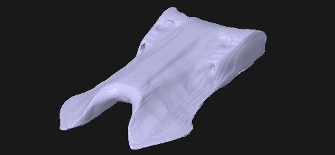
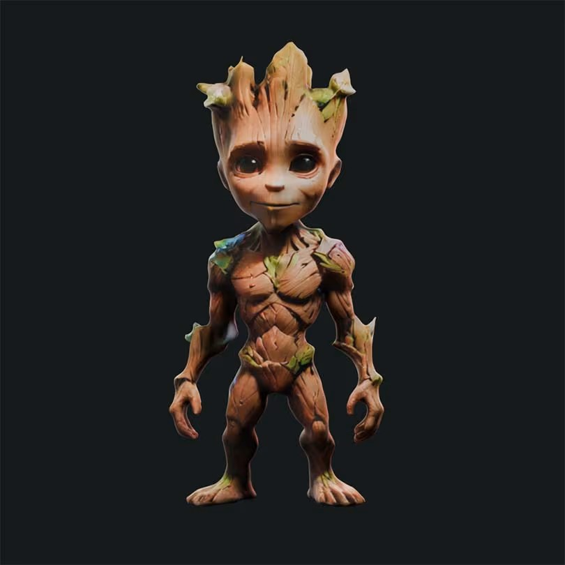
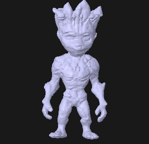

# 3D Model Generator

A versatile tool for generating 3D models from text descriptions or single images using open-source AI models.

## 🌟 Features

- *Text-to-3D*: Transform text descriptions into 3D models using Shap-E
- *Image-to-3D*: Convert single images into 3D models using TripoSR
- *Interactive*: Simple command-line interface for easy model generation

## 🛠 Getting Started

### Quick Setup (Google Colab)

Simply run these cells in order:

#### Cell 1: Clone the repository
bash
!git clone https://github.com/akshith120/TripoSR
%cd "/content/TripoSR"

#### Cell 2: Install dependencies
bash
!pip install -r requirements.txt

The requirements.txt file includes:

-omegaconf==2.3.0
-Pillow==10.1.0
-einops==0.7.0
-git+https://github.com/tatsy/torchmcubes.git
-transformers==4.39.3
-trimesh==4.0.5
-rembg
-huggingface-hub==0.20.3
-imageio[ffmpeg]
-gradio
-xatlas==0.0.9
-moderngl==5.10.0
-onnxruntime-gpu
-accelerate==0.28.0
-PyOpenGL
-pyopengl_accelerate
-torch
-shap-e @ git+https://github.com/openai/shap-e.git
-pyrender
-numpy

*Important*: Restart your runtime/session after installation completes

#### Cell 3: Verify setup
python
import torch
print("🔍 PyTorch version:", torch.__version__)
print("🧠 CUDA available:", torch.cuda.is_available())
%cd "/content/TripoSR"

## Cell 4: Helper functions
python
### Setup and helper functions for:
### - Visualizing 3D models using pyrender
### - Visualizing 3D models using matplotlib
### - Text-to-3D conversion using Shap-E
### - Image-to-3D conversion using TripoSR

## Cell 5: Run the main program
python
# Main program that:
### - Prompts for text input
### - Prompts for image path
### - Calls appropriate conversion functions
### - Visualizes and saves results

## 💻 Usage

The helper functions in Cell 4 take care of visualizing and handling text prompts and image prompts. The main program in Cell 5 is responsible for taking user input.

When you run the main cell (Cell 5), you'll be prompted to:

1. Enter a text prompt for Text-to-3D generation
   - Example: "A detailed sculpture of a dragon"
   - Leave blank to skip text-to-3D generation

2. Enter an image path for Image-to-3D generation
   - Make sure to upload your image to Colab first
   - Example: "/content/my_image.jpg"
   - Leave blank or provide invalid path to skip

The program will:
- Generate 3D models based on your inputs
- Save outputs as .obj files in designated folders
- Display the 3D models using Matplotlib

## 📊 Example Results

### Text-to-3D Example

*Text Prompt:* "A Futuristic Aircraft"

### Image-to-3D Example

*Input Image:*

*3D Output:*

## ⚙ Advanced Configuration

### Shap-E Performance Tuning

For higher quality text-to-3D models, you can modify the run_shapee_text_to_3d function to adjust these parameters:

- *guidance_scale*: Increasing this value (e.g., to 20) improves model adherence to the text prompt
- *karras_steps*: Higher values create more refined geometry and details

Example modification for better quality:

python
latents = sample_latents(
    batch_size=1,
    model=model,
    diffusion=diffusion,
    guidance_scale=20.0,  # Increased from default 15.0
    model_kwargs={'texts': [prompt]},
    progress=True,
    clip_denoised=True,
    use_fp16=True,
    use_karras=True,
    karras_steps=100,     # Increased from default 64
    sigma_min=1e-3,
    sigma_max=160,
    s_churn=0,
)

> *Note:* Higher values for these parameters will significantly increase generation time but produce better results. The default values offer a good balance between quality and speed.

## 📝 Notes

- *Quality Comparison*: Image-to-3D conversion typically produces better results than text-to-3D
- *Hardware Requirements*: A CUDA-compatible GPU is recommended for faster processing
- *Output Location*: Models are saved in /content/outputs/text_input/ and /content/outputs/image_input/
- *Text-to-3D Limitations*: The text-to-3D functionality (using Shap-E) currently does not perform as well as commercial solutions
- *Image-to-3D Quality*: The image-to-3D conversion (using TripoSR) performs significantly better and produces more reliable results

## 🔗 Credits

Based on two open-source AI models:
- [TripoSR](https://github.com/akshith120/TripoSR) for image-to-3D conversion
- [Shap-E](https://github.com/openai/shap-e) for text-to-3D generation
